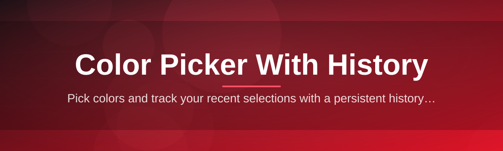
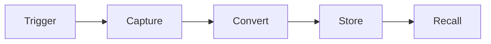

# color-picker-history-manager 🎨🕰️

  

*A color picker that actually remembers what you picked, so you don't have to.*

  

**Every color picker on the planet forgets your last shade the moment you close it — this one doesn't.** I built `color-picker-history-manager` after losing the exact hex of a client's brand blue for the fourth time in a single afternoon, and I got tired of pretending sticky notes were a workflow.

<strong>📖 The full story — why this exists</strong>

 

It started small. I was designing UI mockups late one night, eyedropping colors off reference images, tweaking a palette, undoing, redoing — and every single time I closed the picker, the color I'd just spent ten minutes dialing in vanished into the void. Windows' built-in picker doesn't remember anything. Most third-party pickers treat "history" as an afterthought, if they bother with it at all.

So I started sketching out what a *color picker with memory* should actually feel like. Not just a swatch strip bolted onto a color wheel, but a genuine history system — searchable, taggable, exportable — that treats every color you've ever sampled as something worth keeping. A tool that respects the fact that color work is iterative, not one-shot.

`color-picker-history-manager` is the result. It's a lightweight, standalone Windows app that sits quietly in your workflow, eyedrops colors from anywhere on screen, and builds you a persistent, browsable timeline of everything you've picked — across sessions, across projects, across weeks. No accounts, no cloud sync, no nonsense. Just your colors, remembered.

---

## 🧭 Overview

`color-picker-history-manager` is a native Windows desktop utility built for one purpose: picking colors *and never losing them*. At its core it's a screen-sampling color picker — click anywhere on your display and grab the exact pixel value — but the real engine underneath is a rolling, persistent history manager that logs every pick with a timestamp, source context, and format snapshot (HEX, RGB, HSL, HSV, CMYK).

This exists because designers, developers, illustrators, and QA testers all share the same tiny daily frustration: color work is rarely linear. You pick a color, use it, go back for a slightly different shade, then realize you actually needed the *first* one after all. Traditional color pickers treat each pick as disposable. This one treats your palette history as a living document — something you can scroll back through, favorite, group into project sets, and export whenever you need to hand off a final palette to a teammate or drop it straight into a stylesheet.

Who it's for: front-end developers pulling hex codes for CSS, digital artists building consistent character palettes, UI/UX designers maintaining brand consistency across mockups, and anyone who has ever screamed internally because they closed a color dialog one click too early. If that's you, welcome home.

---

## ⚔️ How It Stacks Up

> [!TIP]
> Skim this table first — it's the fastest way to see why a dedicated history-driven color picker beats the built-in tools you're probably using right now.

| Capability | color-picker-history-manager | Windows Built-in Picker | Generic Browser Extensions |
|---|---|---|---|
| Persistent color history | ✅ Unlimited, searchable | ❌ None | ⚠️ Session-only, usually lost on tab close |
| Screen-wide eyedropper | ✅ Any pixel, any app | ⚠️ Limited to some apps | ⚠️ Browser tab only |
| Multi-format export (HEX/RGB/HSL/HSV/CMYK) | ✅ All formats, one click | ❌ HEX/RGB only | ⚠️ Varies wildly |
| Palette grouping & tagging | ✅ Project-based sets | ❌ Not available | ❌ Not available |
| Offline, standalone, no account | ✅ Fully local | ✅ Local | ❌ Often cloud-tied |
| Keyboard-first workflow | ✅ Full shortcut set | ⚠️ Minimal | ❌ Mouse-driven |
| Zero dependencies | ✅ Single executable | ✅ Built-in | ❌ Requires browser + extension store |

---

## 🔥 What Makes It Tick

- **The Eyedropper That Never Blinks** — sample any pixel on any window, any app, any monitor. It doesn't care whether the color lives in Photoshop, a browser, or a game running in the background.

- **A Memory That Doesn't Reset** — your color history persists across app restarts and system reboots. Pick a color on Monday, find it waiting for you on Friday.

- **Searchable Palette Timeline** — scroll, filter by hue, or search by hex fragment across your entire pick history instead of squinting at a tiny recent-colors strip.

- **Project-Based Color Sets** — group picks into named collections so your "Client Rebrand" palette never gets tangled up with your "Weekend Game Jam" palette.

- **One-Click Multi-Format Copy** — every stored color instantly converts to HEX, RGB, HSL, HSV, or CMYK, so you're never manually converting values by hand again.

- **Favorites & Pins** — star the colors you know you'll need again, keeping them permanently above the noise of one-off experimental picks.

- **Export Anywhere** — dump your history or a named palette set to a shareable file for handoff to teammates or import into design tools.

- **Zoomed Precision Preview** — a magnified pixel-level view before you commit to a pick, because "close enough" isn't good enough when brand guidelines are on the line.

> [!NOTE]
> All history data is stored locally on your machine. Nothing leaves your device — this is a color picker, not a telemetry farm.

---

## 🚀 Up and Running

Getting started takes less time than deciding which shade of blue you actually meant.

1. **Visit the landing page** using the download button above or below — that's the official home for this project.

2. **Download the latest release** for Windows. It's a single standalone package, no bundled installers-within-installers.

3. **Run it directly** — no setup wizard, no account creation, no license key to type in.

4. **Start picking colors** — the eyedropper is live immediately, and your history begins recording from your very first pick.

> [!TIP]
> Pin the app to your taskbar right after your first launch. You'll be reaching for it more often than you expect.

---

## 🖥️ System Requirements

| Requirement | Details |
|---|---|
| OS | Windows 10 or Windows 11 (64-bit) |
| Dependencies | None — fully standalone executable |
| Disk space | Under 50 MB |
| Internet | Not required after download |
| Account | None needed, ever |

  

---

## ⚙️ How It Works

Under the hood, the app follows a simple, deliberate pipeline every time you sample a color — designed to be fast enough that it never interrupts your creative flow.

1. **Trigger** — you invoke the eyedropper via hotkey or the app window.
2. **Capture** — the tool reads the exact pixel value under your cursor, screen-wide.
3. **Convert** — the raw pixel is instantly translated into HEX, RGB, HSL, HSV, and CMYK.
4. **Store** — the pick is timestamped and written into your persistent local history.
5. **Recall** — anytime later, you browse, search, tag, or export that pick from the history panel.

> [!IMPORTANT]
> History storage is local-first by design. There is no cloud dependency in the capture-to-store pipeline, which is exactly why it works offline.

---

## 🧩 Troubleshooting

<strong>The eyedropper won't sample colors from a specific app</strong>

 

Some applications render using hardware-accelerated overlays that block screen sampling at the OS level. Try toggling the target app's rendering/graphics settings, or sample from a screenshot of that app instead.

<strong>My color history disappeared after an update</strong>

 

History is stored locally in a dedicated data folder that updates should never touch. If it's missing, check that you're launching from the same install location as before — a moved or duplicated executable can sometimes point to a different data path.

<strong>Copied hex values don't match what I see on screen</strong>

 

This is almost always a monitor color profile or OS-level color management issue, not a picker bug. Check your display's ICC profile settings — the picker reads raw pixel data, so a mismatched profile can shift perceived vs. actual values.

<strong>Can I recover a color I picked weeks ago?</strong>

 

Yes — that's the entire point. Use the search/filter bar in the history panel and search by approximate hex, hue, or the date range you remember picking it in.

<strong>The app feels slow when history gets very large</strong>

 

Very large histories (tens of thousands of entries) can be trimmed or archived into exported palette sets to keep the active view snappy. Archiving doesn't delete the data — it just moves it out of the live list.

> [!WARNING]
> Avoid manually editing the local history data files outside the app. Malformed entries can prevent the history panel from loading correctly.

---

## 🎛️ UI & UX Details

| Shortcut | Action |
|---|---|
| `Ctrl + P` | Activate eyedropper |
| `Ctrl + H` | Open history panel |
| `Ctrl + F` | Search history |
| `Ctrl + D` | Duplicate/pin current color |
| `Ctrl + E` | Export current palette set |
| `Esc` | Cancel active pick |

- **Themes**: Light, Dark, and an auto mode that follows your Windows system theme.
- **Zoom Preview**: adjustable magnification level for pixel-precise sampling.
- **Layout**: resizable, dockable history panel so it can sit alongside your actual creative work.
- **Color format default**: choose HEX, RGB, HSL, HSV, or CMYK as your one-click copy format.

---

## 🤝 Contributing & Community

> [!NOTE]
> This project grew out of a genuine personal itch, and it keeps growing because other people had the exact same itch.

Bug reports, feature ideas, and design feedback are all welcome through the Issues tab. If you're proposing a new capability, a short description of the real-world workflow it solves is more valuable than a wall of technical spec — this tool is built around actual color-picking habits, not feature checklists.

Pull requests are reviewed with an eye toward keeping the app lightweight and dependency-free — that's a core design principle, not a limitation.

---

## 📜 License

Released under the